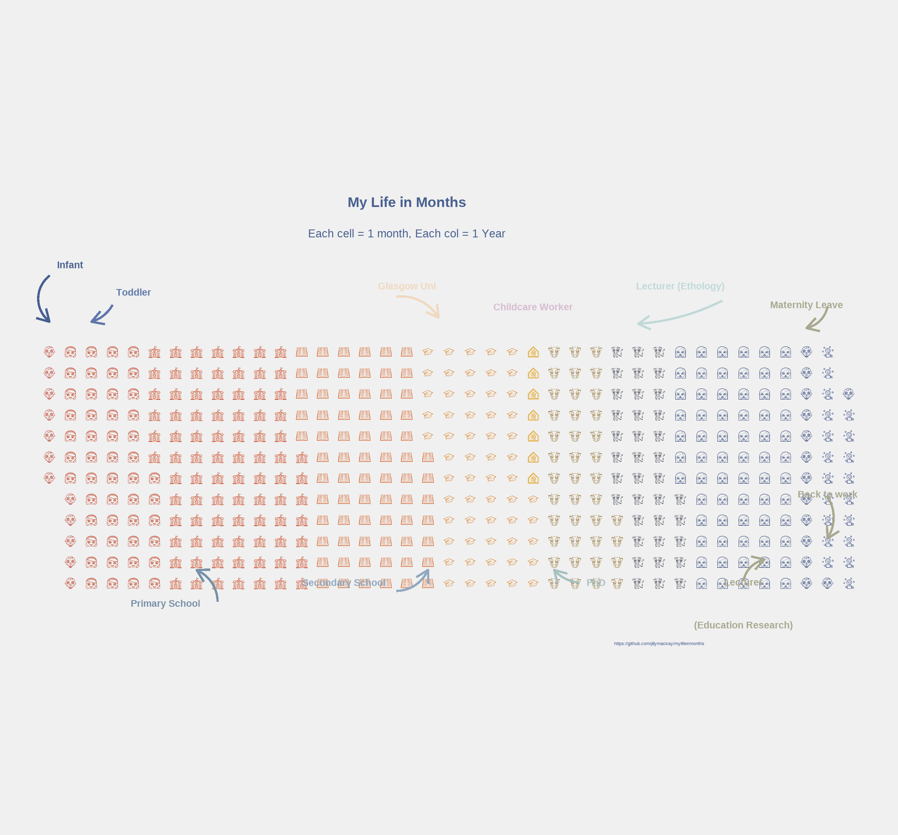

# My Life In Months

Inspired by [sharlagelfand](https://github.com/sharlagelfand/mylifeinmonths) (in turn inspired by [Isabella Benabaye](https://isabella-b.com/blog/my-life-in-months/))

I couldn't get `waffle` to work, so I use `ggwaffle` instead! 

Those annotations and `extrafont` really are a pain in the arse. 

